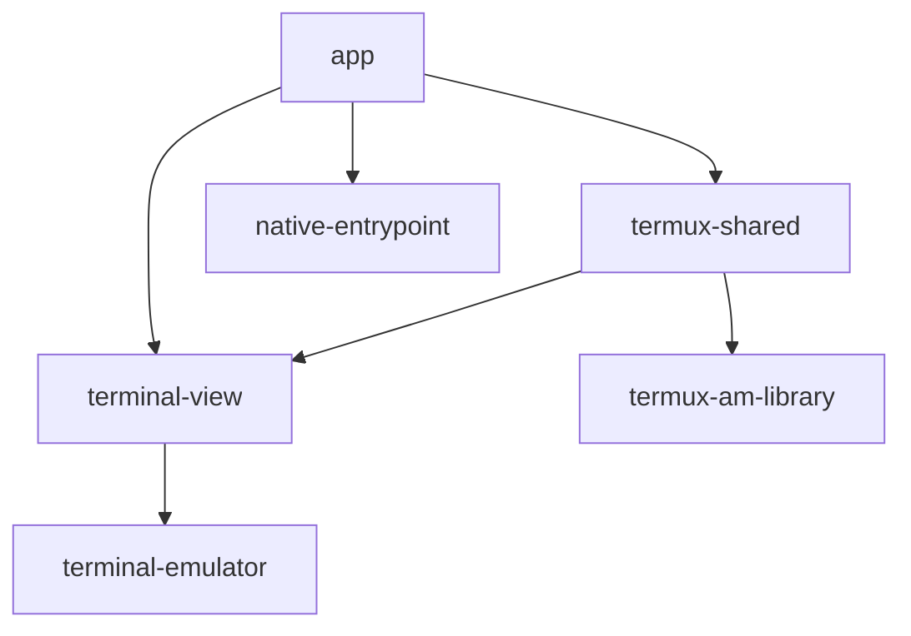

# Internal Module Dependency Map: `termux-launcher-shizuku`

This document maps how the different modules within this repository depend on each other.

## Dependency Graph

## Module-Specific Dependencies

### `app`
- `:terminal-view`
- `:termux-shared`
- `:native-entrypoint`

### `terminal-view`
- `:terminal-emulator`

### `termux-shared`
- `:terminal-view`
- `:termux-am-library`

### `terminal-emulator`
- *No internal module dependencies.*

### `termux-am-library`
- *No internal module dependencies.*

### `native-entrypoint`
- *No internal module dependencies.*

## Summary
The `app` module is the primary consumer, depending on almost all other components. `termux-shared` acts as a common utility layer but interestingly depends on `terminal-view` and `termux-am-library`. The `terminal-emulator` and `native-entrypoint` modules are at the base of the dependency tree.
